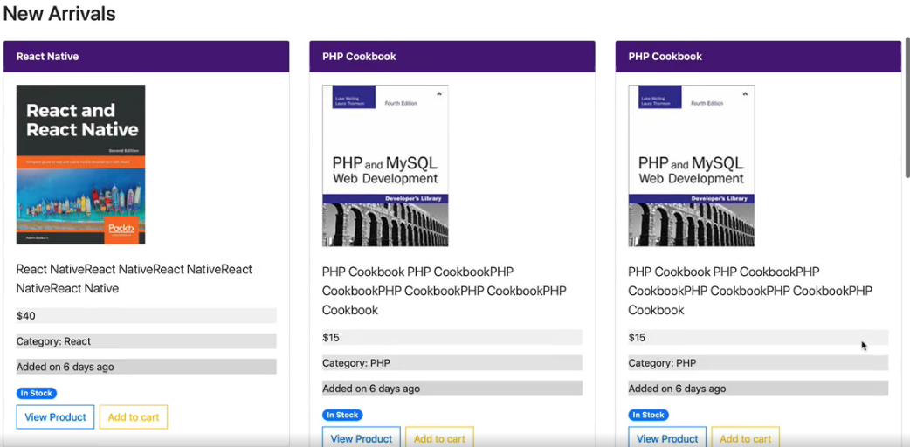
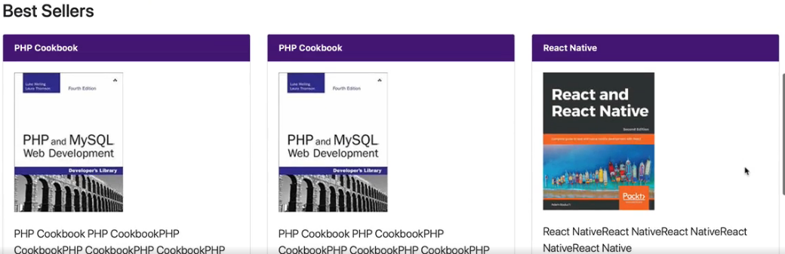
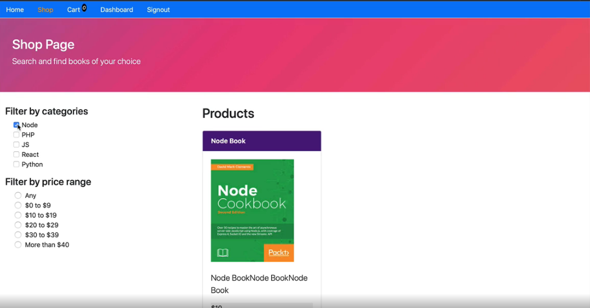
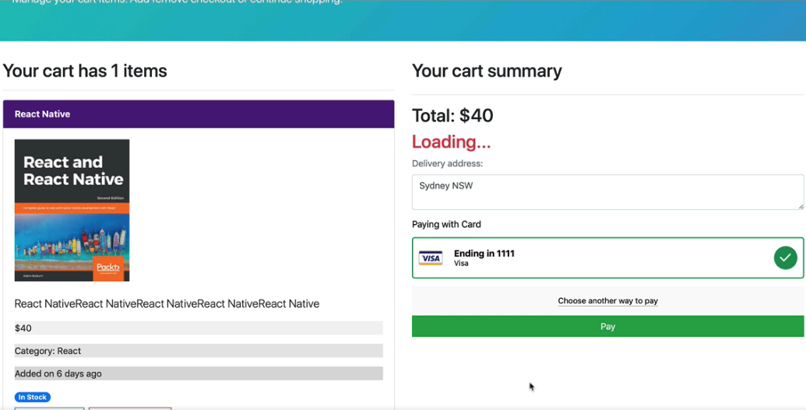
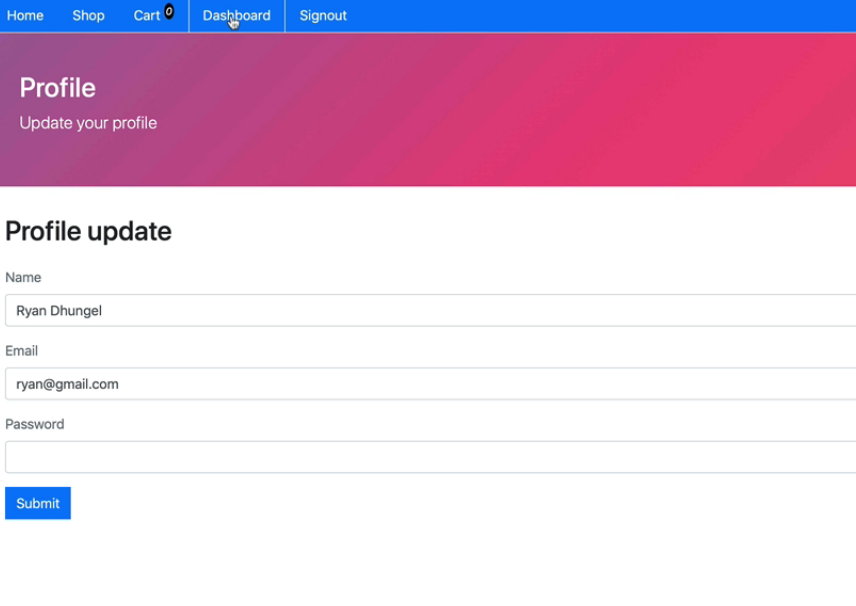

# MERN-ecommerce-app

Full Stack / MERN Stack (Mongo Express React Node) Powered Ecommerce App from Scratch to Deoplyment

Features:
  - Search product
  - Search products based on particular category
  - New arrivals
  - Best sellers
  - Product image
  - Product image
  - Product information
  - Product in stock/out of stock
  - View product
  - Related product
  - Add to cart
  - Remove product
  - Adjust quantity
  - Signin to checkout
  - User dashboard
  - Admin dashboard
  - Private routes
  - Admin routes
  - Shopping cart
  - Checkout with credit card and paypal
  - Checkout with delivery address
  - Success message
  - Update profile
  - Advance search of products
  - Advance search based on category and price range
  - Load more products
  - Admin dashboard
  - Create category
  - Create product
  - View orders
  - Manage products update/delete
  - Role based access
  
  
  ## Screenshots of the app
  
   

   
  
   
  
  
  
   

